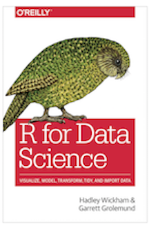

```{r setup, include=FALSE}
knitr::opts_chunk$set(echo = FALSE)
```

## Introduction to R and RStudio

- R is a very popular statistical programming language that was born in New Zealand in 1995. Now consists of base R + 17,000 packages

- RStudio was founded by JJ Allaire in 2009 and is the most popular IDE for R coders

- www.rstudio.com

- RStudio also builds and maintains the tidyverse, a popular collection of R packages

- www.tidyverse.org

- Shiny was created by RStudio CTO Joe Cheng and enables R coders to build interactive, web-based dashboards straight from R

- shiny.rstudio.com

## Data Science Paradigm


## Popular packages for Finance

```{r, echo = TRUE, eval = FALSE}
library(PerformanceAnalytics)
library(PortfolioAnalytics)
library(TTR)
library(tidyquant)
library(timetk)
library(tibbletime)
library(quantmod)
library(xts)
```


List of packages for finance here:
https://cran.r-project.org/web/views/Finance.html

## Popular packages for Visualization

```{r, echo = TRUE, eval = FALSE}
library(ggplot2)
library(dygraphs)
library(highcharter)
library(plotly)
library(leaflet)
```

## Today's Use Case

- Import price data for 5 ETFs, convert to log returns

- Visualize prices and returns

- Calculate some statistics of interest with built-in functions

- Custom function to calculate rolling 50 and 200-day means

- Visualize custom calculations

- Visualize the trend strategy versus buy-and-hold

## Learn more about R for data science

- http://r4ds.had.co.nz/



## Learn more about R for Finance

- www.reproduciblefinance.com

