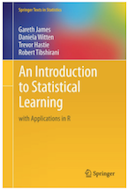

```{r setup, include = FALSE, warning=FALSE, message=FALSE}
knitr::opts_chunk$set(message = FALSE, warning = FALSE, comment = NA)
options(htmltools.dir.version = FALSE)

library(tidyverse)
library(tidyquant)
library(tibbletime)
library(timetk)
library(dygraphs)
library(highcharter)
library(broom)

sma_50 <- rollify(mean, window = 50)
sma_200 <- rollify(mean, window = 200)
sd_50 <- rollify(sd, window = 50)
sd_200 <- rollify(sd, window = 200)

```


# Introducing R and RStudio

+ Statistical programming language -> by data scientists, for data scientists
+ Base R + 17,000 packages
+ RStudio
+ Shiny
+ sparklyr
+ tensorflow
+ Rmarkdown
+ database connectors
+ htmlwidgets

---

# Quant pipeline


www.business-science.io/business/2018/09/18/data-science-team.html

---

# Data Sci Paradigm


---

# Packages for finance

```{r, eval = FALSE}
library(PerformanceAnalytics)
library(PortfolioAnalytics)
library(TTR)
library(tidyquant)
library(quantmod)
library(xts)
```


List of packages for finance here:
https://cran.r-project.org/web/views/Finance.html

---

# Packages for data visualization


```{r, eval = FALSE}
library(ggplot2)
library(dygraphs)
library(highcharter)
library(shiny)
```

---

# Project: Analyze and Visualize data for 5 ETFS

- Import data for 5 ETFs

- Visualize prices and returns

- Calculate some stats of interest 

- Create an SMA 50 v. SMA 200 chart and rolling sigma band

- Run Monte Carlo simulation and visualize

    
---

# Import Data

- Excel using `read_excel`

- csv using `read_csv`

- yahoo! Finance using `getSymbols` or `tq_get`

- sql, or some internal database, using `dbConnect`

- increasingly common via API with `httr` and `jsonlite`

---

# 5 ETFs

    + SPY (S&P500 fund)
    + EFA (a non-US equities fund) 
    + IJS (a small-cap value fund) 
    + EEM (an emerging-mkts fund)
    + AGG (a bond fund)


`symbols <- c("SPY", "EFA", "IJS", "EEM", "AGG")`

`tq_get(symbols, from  = "2012-12-31", to = "2017-12-31")` 


```{r, echo = FALSE}

symbols <- c("SPY", "EFA", "IJS", "EEM", "AGG")


etf_prices<-
  tq_get(symbols, from  = "2012-12-31", to = "2017-12-31") %>% 
  select(symbol, date, adjusted) %>% 
  spread(symbol, adjusted) %>% 
  tk_xts(date_var = date)

head(etf_prices)
```

---

```{r, eval = FALSE}
highchart(type = "stock") %>% 
  hc_add_series(etf_prices[,3], name = symbols[3]) %>% 
  hc_add_series(etf_prices[,2], name = symbols[2]) %>% 
  hc_add_series(etf_prices[,5], name = symbols[5]) %>% 
  hc_title(text = "Highcharter")
```

--

```{r, echo = FALSE}
highchart(type = "stock") %>% 
  hc_add_series(etf_prices[,1], name = symbols[1]) %>% 
  hc_add_series(etf_prices[,2], name = symbols[2]) %>% 
  hc_add_series(etf_prices[,5], name = symbols[5]) %>% 
  hc_title(text = "Highcharter") %>% 
  hc_tooltip(pointFormat = "{point.series.name}: ${point.y: .2f}")
```

---

# PerformanceAnalytics

Use the built-in `Return.calculate` function and specify `log`.

`etf_returns <- Return.calculate(etf_prices, method = "log")`

--

```{r, echo = FALSE}
etf_returns <- Return.calculate(etf_prices, method = "log")

head(etf_returns)
```


---

`table.Stats(etf_returns)`

--

```{r, echo = FALSE}
table.Stats(etf_returns)
```

---

`table.CAPM(etf_returns, etf_returns$SPY)`

--

```{r, echo = FALSE}
table.CAPM(etf_returns, etf_returns$SPY)
```

---

# ggplot

`ggplot(aes(x = SPY, y = return, color = symbol)) + geom_point(alpha = .5)`

```{r, echo = FALSE}
gg_scatter <- etf_returns %>% 
  tk_tbl(rename_index = "date") %>% 
  select(-date) %>% 
  gather(symbol, return, -SPY) %>% 
  ggplot(aes(x = SPY, y = return, color = symbol)) +
  geom_point(alpha = .5) +
  facet_wrap(~symbol)
```

--

```{r, echo= FALSE}
gg_scatter
```

---
Add regression line and standard errors with 

`geom_smooth(formula = y ~ x, se = TRUE)`

--

````{r, echo = FALSE}
etf_returns %>% 
  tk_tbl(rename_index = "date") %>% 
  select(-date) %>% 
  gather(symbol, return, -SPY) %>% 
  ggplot(aes(x = SPY, y = return, color = symbol)) +
  geom_point(alpha = .5) + 
  geom_smooth(formula = y ~ x, se = TRUE) +
  facet_wrap(~symbol)
```

---

An interactive scatter

`hchart(etf_returns, type = "scatter", hcaes(x = SPY, y = EEM, date = date))`

--

```{r, echo=  FALSE}
  etf_returns %>% 
  tk_tbl(rename_index = "date") %>% 
  hchart(., type = "scatter", hcaes(x = SPY, y = EEM, date = date)) %>% 
  hc_xAxis(title = list(text = "Market Returns")) %>% 
  hc_yAxis(title = list(text = "EEM Returns")) %>% 
  hc_title(text = "Emerging Market v. SPY") %>% 
  hc_tooltip(pointFormat = "date: {point.date} <br> 
             EEM return: {point.y:.4f}  <br> 
             mkt return: {point.x:.4f}")
```

---

Grab beta or slope of regression line.

```{r}
slope <- table.CAPM(etf_returns, etf_returns$SPY)[2, 2]
```

Add the regression line to the original scatter

`hc_add_series(etf_returns, "line", hcaes(x = SPY, y = SPY * slope))`

--

```{r, echo=FALSE}

etf_returns_tibble <- 
etf_returns %>% 
  tk_tbl(rename_index = "date")

  etf_returns %>% 
  tk_tbl(rename_index = "date") %>% 
  hchart(., type = "scatter", 
         hcaes(x = SPY, y = EEM, date = date)) %>%
  hc_add_series(etf_returns_tibble, "line", 
                hcaes(x = SPY, 
                      y = SPY * slope)) %>% 
  hc_xAxis(title = list(text = "Market Returns"),
           labels = list(format = "{value}%")) %>% 
  hc_yAxis(title = list(text = "EEM Returns"),
           labels = list(format = "{value}%")) %>% 
  hc_title(text = "Scatter with Beta Line")
```

---

### Other Nice Functions (too many to list)

```{r, eval = FALSE}
table.DownsideRisk(etf_returns, Rf= .0003)
table.Drawdowns(etf_returns$EEM)
SharpeRatio(etf_returns, Rf = .0003)
InformationRatio(etf_returns, etf_returns$SPY)
SemiDeviation(etf_returns)
```
--

```{r, echo=FALSE}
table.DownsideRisk(etf_returns, Rf = .0003)
```


---
### Standard Deviation of each asset

`StdDev(na.omit(etf_returns))`

--

```{r, echo = FALSE}
StdDev(na.omit(etf_returns))
```

--
### Portfolio Standard Deviation

`StdDev(na.omit(etf_returns), weights = c(.1, .2, .2, .2, .3))`
--

--

```{r, echo = FALSE}
StdDev(na.omit(etf_returns), 
       weights = c(.1, .2, .2, .2, .3))
```

---

### Visualize Contribution to Portfolio Standard Deviation  
`ggplot(aes(x = symbols, y = pct_contrib_StdDev, fill = symbols)) + geom_col(width = .5)`

```{r, echo = FALSE}
StdDev(na.omit(etf_returns$AGG))
StdDev(na.omit(etf_returns), 
       weights = c(.1, .2, .2, .2, .3), 
       portfolio_method = "component") %>% 
  as.tibble() %>% 
  add_column(symbols = sort(symbols)) %>% 
  ggplot(aes(x = symbols, y = pct_contrib_StdDev, fill = symbols)) +
  geom_col(width = .5) +
  labs(y = "percent contribution to vol", x = "", title = "Asset Contribution to Vol") +
  scale_y_continuous(labels = scales::percent)
```

---

Interactive Contribution Chart

`hchart(., hcaes(x = symbols, y = pct_contrib_StdDev, group = symbols), type = "column") `

```{r, echo = FALSE}
StdDev(na.omit(etf_returns), 
       weights = c(.1, .2, .2, .2, .3), 
       portfolio_method = "component") %>% 
  as.tibble() %>% 
  add_column(symbols = sort(symbols)) %>% 
  hchart(., hcaes(x = symbols, y = pct_contrib_StdDev, group = symbols), type = "column") %>% 
  hc_title(text = "Asset Contribution to Standard Deviation")
```

---

### Rolling Mean Calculations and Visualization: our own functions

```{r}
sma_50 <- rollify(mean, window = 50)
sma_200 <- rollify(mean, window = 200)
sd_50 <- rollify(sd, window = 50)
sd_200 <- rollify(sd, window = 200)

etf_rolling_calculations <-  
  etf_prices %>% 
  tk_tbl(rename_index = "date") %>% 
  select(date, SPY) %>% 
  mutate(sma50 = sma_50(SPY),
         sma200 = sma_200(SPY),
         sd200_lower = sma200 - sd_200(SPY),
         sd200_upper = sma200 + sd_200(SPY),
         signal = ifelse(sma50 > sma200, 1, 0)
         ) %>%
  select(-SPY) %>% 
  na.omit()
```

---

```{r, echo = FALSE}
highchart()%>%
  hc_add_series(etf_rolling_calculations, type = "line", 
                hcaes(x = date, y = sma200), 
                name = "sma200"
                ) %>%
 hc_add_series(etf_rolling_calculations, type = "line", 
                hcaes(x = date, y = sma50), 
                name = "sma50",
               color = "green") %>%
  hc_add_series(etf_rolling_calculations, 
                type = "arearange", 
                hcaes(x = date, 
                      low = sd200_lower, 
                      high = sd200_upper),
                color = "pink",
                alpha = .25,
                fillOpacity = 0.3,
                showInLegend = FALSE
                ) %>%
  hc_title(text = "SMA 50 v. SMA 200") %>% 
      hc_xAxis(type = 'datetime'#,
                 # plotBands = list(
                 #   list(
                 #     label = list(text = "Election Season"),
                 #     color = "rgba(100, 0, 0, 0.1)",
                 #     from = datetime_to_timestamp(as.Date('2016-10-01', tz = 'UTC')),
                 #     to = datetime_to_timestamp(as.Date('2017-01-01', tz = 'UTC'))
                 #     ))
               ) %>% 
  hc_navigator(enabled = FALSE) %>% 
  hc_scrollbar(enabled = FALSE) %>% 
  hc_legend(enabled = TRUE) %>% 
  hc_exporting(enabled = TRUE) 
```

---

Create Trade Signal

```{r}
etf_trend <- 
  etf_prices %>% 
  tk_tbl(rename_index = "date") %>% 
  select(date, SPY) %>% 
  mutate(sma50 = sma_50(SPY),
         sma200 = sma_200(SPY),
         returns = log(SPY) - log(lag(SPY)),
         signal = ifelse(sma50 > sma200, 1, 0),
         daily_treas = (1 + (2/100)) ^ (1/252) - 1,
         buy_hold_returns = (.9 * returns) + (.1 * daily_treas),
         trend_returns = 
           if_else(lag(signal) == 1, 
                   (signal * returns), daily_treas)
         ) %>%
  na.omit() %>% 
  mutate(trend_growth = accumulate(1 + trend_returns, `*`),
        buy_hold_growth = accumulate(1 + buy_hold_returns, `*`)) %>%
  select(date, trend_growth, buy_hold_growth) %>% 
  tk_xts(date_var = date) 
```

---

### Visualize Growth of Trade Strategy

```{r, echo = FALSE}
highchart(type = "stock") %>% 
  hc_title(text = "Growth") %>%
  hc_add_series(etf_trend$trend_growth, color = "cornflowerblue",  name = "trend") %>%
  hc_add_series(etf_trend$buy_hold_growth, color = "green", name = "buy_hold") %>%
  hc_add_theme(hc_theme_flat()) %>%
  hc_navigator(enabled = FALSE) %>% 
  hc_scrollbar(enabled = FALSE) %>% 
  hc_legend(enabled = TRUE) %>% 
  hc_yAxis(labels = list(format = "${value:,.2f}")) %>% 
  hc_tooltip(pointFormat = "{point.series.name}: ${point.y:.2f}")
```

---

# Simulate with Monte Carlo

```{r}
mean_return <- 
  mean(na.omit(etf_returns$SPY))

stddev_return <- 
  sd(na.omit(etf_returns$SPY))
```

---

### Simulate 120 days of returns

```{r}
simulated_returns <- rnorm(120,
                           mean_return,
                           stddev_return)

simulated_returns %>% head()
```                           

---

### Convert to growth: get functional

```{r}
simulation_accum_1 <- function(init_value, N, mean, stdev) {
    tibble(c(init_value, 1 + rnorm(N, mean, stdev))) %>% 
    `colnames<-`("returns") %>%
    mutate(growth = 
             accumulate(returns, 
                        function(x, y) x * y)) %>% 
    dplyr::select(growth)
}

simulation_accum_1(1, 120, mean_return, stddev_return) %>% 
  tail()

```

---

### Running 50 simulations

```{r}
monte_carlo_rerun_50 <- 
rerun(.n = 50, 
      simulation_accum_1(1, 
                        120,
                        mean_return, 
                        stddev_return)) %>%
  simplify_all() %>% 
  `names<-`(paste("sim", 1:50, sep = " ")) %>%
  as_tibble() %>% 
  mutate(month = seq(1:nrow(.))) %>% 
  dplyr::select(month, everything())

monte_carlo_rerun_50 %>% head()
```

---

### Visualize 51 simulations

```{r, eval = FALSE}
mc_gathered <- 
  monte_carlo_rerun_51 %>% 
  gather(sim, growth, -month) %>% 
  group_by(sim)
# This takes a few seconds to run
hchart(mc_gathered, 
       type = 'line', 
       hcaes(y = growth,
             x = month,
             group = sim)) %>% 
  hc_title(text = "51 Simulations") %>%
  hc_xAxis(title = list(text = "months")) %>%
  hc_yAxis(title = list(text = "dollar growth"),
           labels = list(format = "${value}")) %>%
  hc_add_theme(hc_theme_flat()) %>%
  hc_exporting(enabled = TRUE) %>% 
  hc_legend(enabled = FALSE)
```

---

```{r, echo = FALSE}
mc_gathered <- 
  monte_carlo_rerun_50 %>% 
  gather(sim, growth, -month) %>% 
  group_by(sim)
# This takes a few seconds to run
hchart(mc_gathered, 
       type = 'line', 
       hcaes(y = growth,
             x = month,
             group = sim)) %>% 
  hc_title(text = "50 Simulations") %>%
  hc_xAxis(title = list(text = "months")) %>%
  hc_yAxis(title = list(text = "dollar growth"),
           labels = list(format = "${value}")) %>%
  hc_add_theme(hc_theme_flat()) %>%
  hc_exporting(enabled = TRUE) %>% 
  hc_legend(enabled = FALSE) %>% 
  hc_tooltip(headerFormat = "Future day {point.x}<br>",
     pointFormat = "{point.sim}: ${point.y: .2f}")
```

---

# Other Packages of Interest

```{r, eval = FALSE}
library(forecast) # Good out of the box forecasting tools. Useful for macro trends.
library(h20) # machine learning libraries
library(keras) # deep learning tensorflow.rstudio.com
library(lime) # for ML white-boxing
library(ranger) # random forest
library(recipes) # for ML preprocessing
library(rsample) # for resampling
library(parsnip) # new package for consistent model interface
library(caret) # classification and regression
library(tidytext) # parse text and mining
library(tidyposterior) # posthoc after resampling
```

---

.pull-left[


]

.pull-right[




]

